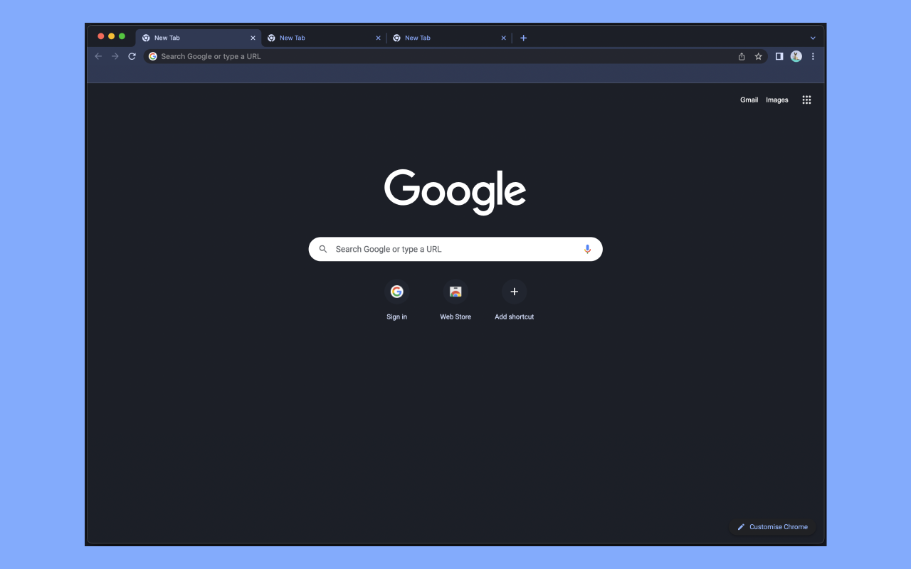

# Lapis Theme • Google Chrome

A dark blue theme for Google Chrome.

## 🚀 Installation

You can install via the <a href="https://chrome.google.com/webstore/detail/lapis-chrome-theme/hmcmhgomamidaaodladnploplghibodb">Chrome Web Store</a>.

**OR**

- Download Zip from this repo.
- Extract Zip.
- Open Google Chrome.
- Navigate to `chrome://extensions`.
- Click the toggle and enable **Developer mode**.
- Select **Load Unpacked**.
- Select the **lapis-google-chrome** folder to install.

## 🛳 Lapis Theme Ports

- [Lapis Terminal.app](https://github.com/aslbarnett/lapis-theme-terminal-app)
- [Lapis Slack](https://github.com/aslbarnett/lapis-theme-slack)
- [Lapis Visual Studio Code](https://marketplace.visualstudio.com/items?itemName=AlexBarnett.lapis-vscode)
